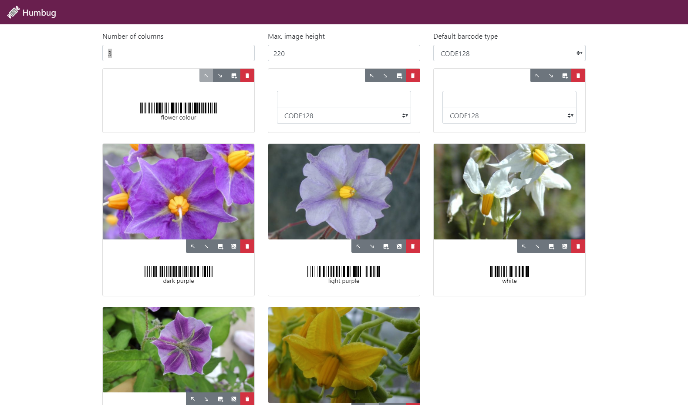

# Humbug

[](https://travis-ci.org/sebastian-raubach/humbug-electron)
[](https://ci.appveyor.com/project/sebastian-raubach/humbug-electron)
[](https://opensource.org/licenses/Apache-2.0)




> Humbug is a multi-platform barcode generator which can be used alongside our [Germinate Scan](http://ics.hutton.ac.uk/get-germinate-scan/) application to generate sheets of user-defined barcodes to aid in the recording of data in the field or glasshouse. Humbug and Germinate Scan are primarily suited for the recording of categorical data categories which could include traits such as flowering time.

> Humbug users define these categories using a simple to use and intuitive desktop application then print out sheets containing a barcode for each data category required. These barcodes can then be scanned using Germinate Scan and saved to text file.

## Examples

An example PDF file created with Humbug is available in the `res` folder.

## Documentation

Please check the [Wiki](../../wiki) for information about how to use Humbug.

## Download

Humbug is available for Windows, Linux and Mac and the latest release can be downloaded from [the releases tab](https://github.com/sebastian-raubach/humbug-electron/releases).

## Build Setup

``` bash
# install dependencies
npm install

# serve with hot reload at localhost:9080
npm run dev

# build electron application for production
npm run build


# lint all JS/Vue component files in `src/`
npm run lint

```

In some cases it may be necessary to run
``` bash
node_modules/.bin/electron-rebuild -f -w sharp
```
To rebuild an image manipulation library that uses native libraries.

## License

    Copyright 2019 Information & Computational Sciences, The James Hutton Institute

    Licensed under the Apache License, Version 2.0 (the "License");
    you may not use this file except in compliance with the License.
    You may obtain a copy of the License at

       http://www.apache.org/licenses/LICENSE-2.0

    Unless required by applicable law or agreed to in writing, software
    distributed under the License is distributed on an "AS IS" BASIS,
    WITHOUT WARRANTIES OR CONDITIONS OF ANY KIND, either express or implied.
    See the License for the specific language governing permissions and
    limitations under the License.

---

This project was generated with [electron-vue](https://github.com/SimulatedGREG/electron-vue)@[8fae476](https://github.com/SimulatedGREG/electron-vue/tree/8fae4763e9d225d3691b627e83b9e09b56f6c935) using [vue-cli](https://github.com/vuejs/vue-cli). Documentation about the original structure can be found [here](https://simulatedgreg.gitbooks.io/electron-vue/content/index.html).
